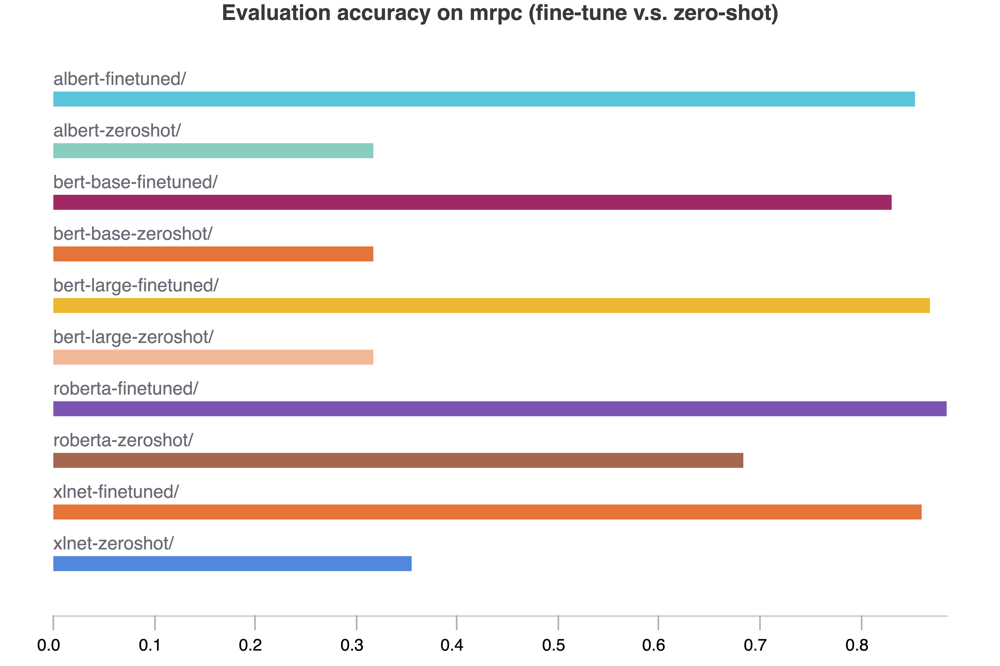
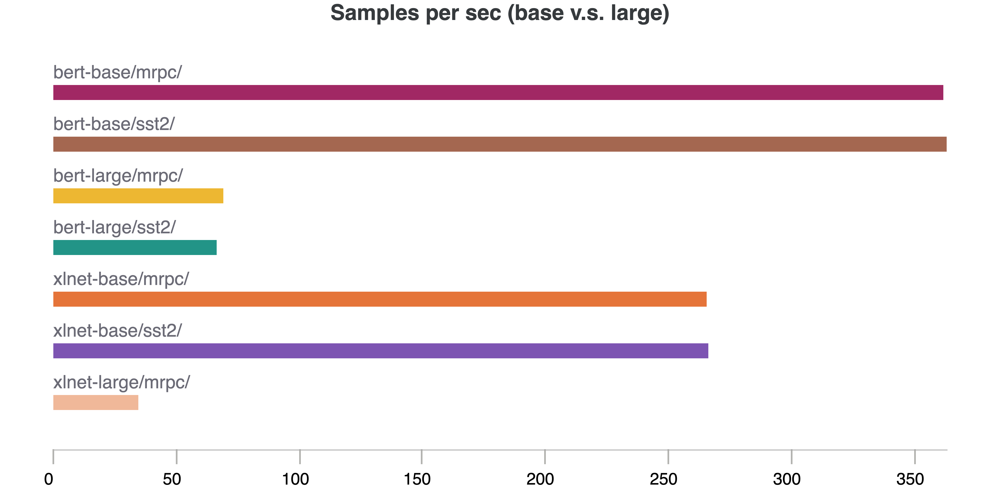

# Text-classification 

## Summary

The summary can contain but is not limited to:

- Code structure.

- In order to run out tests, we had to upload the `run_glue.py` into our Google Colab Notebook. Then, the test script that we used to run tests back-to-back, is th following:
(In Google Colab) This can be run on a GPU by switching the Google Colab runtime to GPU.

```
!pip install datasets
!pip install git+https://github.com/huggingface/transformers

...

%%shell
for MODEL_NAME in albert-base-v1 bert-base-cased bert-large-case xlnet-base-cased xlnet-large-case roberta-base
do
    for TASK_NAME in qqp mnli qnli rte wnli
    do
        echo $TASK_NAME
        CUDA_VISIBLE_DEVICES=0 python run_glue.py \
            --model_name_or_path $MODEL_NAME \
            --task_name $TASK_NAME \
            --do_eval \
            --max_seq_length 128 \
            --per_device_train_batch_size 32 \
            --learning_rate 2e-5 \
            --num_train_epochs 3 \
            --output_dir drive/MyDrive/COLAB_OUTPUTS/saved_dir/${MODEL_NAME}/${TASK_NAME}/
    done
done
```

- Write-up of your findings and conclusions.

## Models

### XLNet

We used two types of architecture, [base cased](https://huggingface.co/xlnet-base-cased) a 12-layer, 768-hidden, 12-heads and a [large cased](https://huggingface.co/xlnet-large-cased)  24-layer, 1024-hidden, 16-heads evaluated on the nine  text classification tasks.Based on [XLNet: Generalized Autoregressive Pretraining for Language Understanding](https://arxiv.org/abs/1906.08237) paper implemented by hugging-face.
### Roberta-Base

We used the a 125M parameter pre-trained [roberta-base](https://huggingface.co/roberta-base) model card implemented by hugging-face based on the [RoBERTa: A Robustly Optimized BERT Pretraining Approach paper ](https://arxiv.org/abs/1907.11692).Model pre-trained using only masked language modeling (MLM) on raw texts with automatic labelling.


### Bert-Large

We used a 24-layer, 1024-hidden, 16-heads, 340M parameters  pre-trained [bert-uncased](https://huggingface.co/bert-base-uncased) model card implemented by hugging-face, based on the [BERT: Pre-training of Deep Bidirectional Transformers for Language Understanding paper](https://arxiv.org/abs/1810.04805). Model was pre-trained using both masked language modeling (MLM) and next sentence prediction (NSP),on large raw texts without human labelling.


### Albert-Base

We used a 12-layer, 768-hidden, 12M parameters  pre-trained uncased model card implemented [Albert-base](https://huggingface.co/transformers/model_doc/albert.html) that is base on the [ALBERT: A Lite BERT for Self-supervised Learning of Language Representations paper](https://arxiv.org/abs/1909.11942).Model was pre-trained using both masked language modelling (MLM) and sentence ordering prediction (SOP) on a large corpus of English data on raw texts only without humans labels,labels are generated automatically texts.


- Ipython notebooks can be organized in `notebooks`.

## Ablation study

### Fine-tune v.s. zero-shot

All evaluations in the above sections are zero-shot results — the pretrained models are asked to predict the testing dataset without fine-tuning on it. In this section, we compare the results between fine-tune and zero-shot on selected dataset. We first compared finetuned models and zero-shot models on dataset sst2 and mrpn. The plot below demonsrates that finetuning can improve the model accuracy by almost 100%. 

<p align="left">
    
    
</p>

### Half precision v.s. single precision 
One of the most interesting option to run transformer like model is the floating point precision. It is common to use mixed precision (half precision: fp16) to improve training speed. There are mainly 3 reasons to favor mixed precision training in practice:
* It speeds training by almost 2x.  
* It consumes much less GPU memory. In the case of large transformer model such as GPT-J (6B parameters), even single batch size takes 24GB GPU memory in float32 precision. Therefore, it is a must to use mixed precision to fit big transformers in most GPUs unless exploring model parallelism.  
* ZeRO Optimizations which offload GPU memory to CPU during some stages of training only supports half precision. 

Therefore, in this section, we conducted an ablation study on half precision v.s. single precision. The focus is to examine if half precision leads to any accuracy loss. And the following plot demonsrates that there is no significant evaluation accuracy loss when dropping half precision.

<p align="left">
    
</p>

### Base model v.s. large model

One of the gold standard in transformer model is the bigger the better. In this section, we take a closer on this standard on our datasets. We selected BERT-base, BERT-large, XLNet and XLNet-large to conduct the comparison. We also normalized the accuracy by the number of parameters or the per step time to see if there is a diminishing effect to increase model size.

<p align="left">
    
    
</p>

The above plots showed that increasing the number of parameters by 3X on BERT model leads to roughly 10% improvement in accuracy. The runtime overhead is about 5X. Therefore, the complexity cost of increasing model parameters is more than the accuracy gain.

### Cased v.s. uncased

Most pretrained models come with two options — cased and uncased. Most uncased models are pretrained on lower-cased English text. In this section, we examine if the choice of cased/uncased pretrained models can lead to a difference in the downstream tasks. 

The plot below shows that there is no significant accuracy difference on tasks sst2 and mrpc between cased BERT and uncased BERT.

<p align="left">
    
</p>
